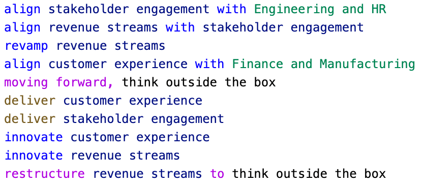
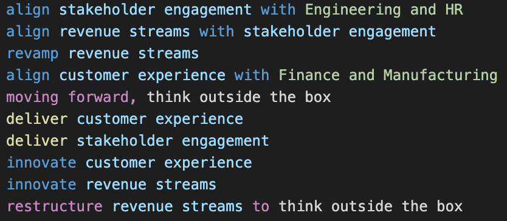

# vscode-strategic-communication

[Strategic Communication](https://github.com/rotoclone/strategic-communication) syntax highlighting for Visual Studio Code

| Light theme | Dark theme |
| --- | --- |
|  |  |

## Usage

```bash
cd $HOME/.vscode/extensions
git clone https://github.com/dnchu/vscode-strategic-communication
```
